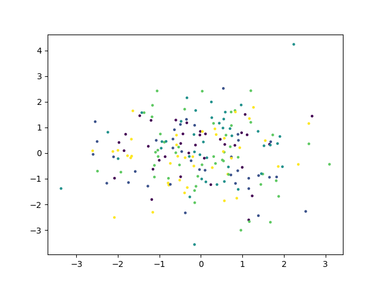
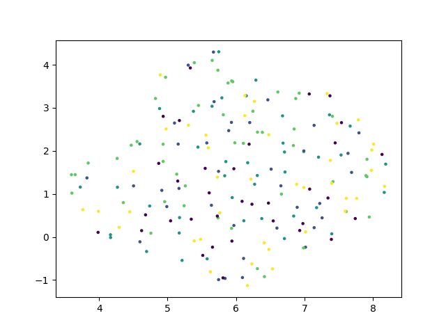
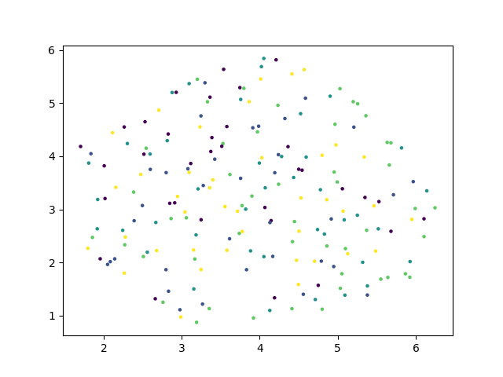

# Projection-based Gossip における意味空間崩壊の解析

**— Silhouette Score・PCA・UMAP に基づく比較実験報告 —**

## 概要（Abstract）

本レポートでは、Projection-based Gossip を用いた **実験C** の結果について、
Silhouette Score の時系列推移および Belief 空間の可視化（PCA / UMAP）を中心に解析を行う。
実験A（固定グラフ）・実験B（ランダムグラフ＋Identity）との比較を通じて、本実験の最大の特徴である

* **PCA 分散の極小化（10⁻¹⁵スケール）**
* **Silhouette Score の急激な崩壊と振動**

が示す意味を考察する。

結論として、本実験は単なる収束やノイズ化ではなく、
**意味空間そのものの構造的崩壊（Structural Collapse）** を示している。

---

## 実験設定の概要

* **対象**：エージェントの信念ベクトル（Belief vectors）
* **ネットワーク**：ランダムグラフ
* **更新則**：Projection-based Gossip
  （隣接ノードの信念を Projection により射影して更新）
* **比較対象**

  * 実験A：固定グラフ（構造保存型）
  * 実験B：ランダムグラフ＋Identity（平均化・混合型）
  * 実験C：ランダムグラフ＋Projection（本実験）

---

## 可視化結果

### Belief PCA

### Belief UMAP

### Silhouette Score の時系列推移

[Silhouette](../experiments/result/geometry01/expB/metrics.txt)

---

## 1. Silhouette Score の時系列解析

### ― クラスタ崩壊としての位相転移 ―

`silhouette_time.png` に示されるように、Silhouette Score は以下の挙動を示す。

#### 初期段階（t = 0〜30）

* スコアは **0.15〜0.25** の正の値を維持
* クラスタ構造が一定程度保たれている状態

この挙動は、実験A（固定グラフ）における
**コミュニティ内の安定したエコーチェンバー**に近い。

#### 急落と振動（t ≳ 30）

* スコアが **負の値** に突入
* 以降、激しい振動を繰り返す

Silhouette Score が負になることは、

* 各点が「自分の属するクラスタ」よりも
* 「他クラスタの点」に近い

もしくは、

* **クラスタという概念自体が消失した**

ことを意味する。

実験B（Identity による平均化）であれば、
スコアは **0 に近づきながら単調に減衰**するはずである。
しかし、本実験Cでは**減衰ではなく乱高下**が生じており、

> Projection によって信念ベクトルが
> 安定な収束点を見出せず、
> 空間内で不安定に反射している
> あるいは空間そのものが縮退している

と解釈できる。

---

## 2. PCA と UMAP の対比

### ― 線形構造の消失と「無」の可視化 ―

### 2.1 PCA：線形分散の完全崩壊

`belief_pca.png` において最も重要なのは、
**軸スケールが 10⁻¹⁵ オーダー**である点である。

* 分散は **倍精度浮動小数点の誤差レベル**
* 実質的に、全信念ベクトルが **同一点**に押し潰されている

これは Projection の反復適用が、数学的に

* **縮小写像（Contraction Mapping）**
* あるいは **ランク落ち変換の連鎖**

として機能し、
信念空間の自由度を完全に奪ったことを示唆する。

---

### 2.2 UMAP：構造ではなくアーティファクト

一方、`belief_umap.png` では一見すると散らばりが存在する。

しかし PCA の結果と併せて解釈すると、これは

* 実際の構造ではなく
* **ほぼゼロ距離の点群に対する数値誤差の可視化**

である可能性が高い。

UMAP は局所距離を保存しようとするが、

* 全点間距離 ≈ 0

という状況では、

> 微小な誤差や初期値の違いを
> あたかも意味のある構造であるかのように
> 展開してしまう

したがって、本実験における UMAP は
**「意味空間」ではなく「数値ノイズ」を描画している**と判断できる。

---

## 3. 実験A・B・Cの比較整理

| 実験      | 特徴              | 結果              |
| ------- | --------------- | --------------- |
| 実験A     | 固定グラフ           | 構造保存・安定クラスタ     |
| 実験B     | ランダム＋Identity   | 平均化によるコンセンサス    |
| **実験C** | ランダム＋Projection | **情報の縮退・意味の消失** |

実験Cでは、

* ランダムグラフによる混合
* Projection による次元削減・成分除去

が同時に作用し、
**系全体の情報量（分散）が急速に失われた**。

---

## 4. Projection-based Gossip の本質的性質

本結果から、Projection-based Gossip は以下のように位置づけられる。

### 単なるノイズではない

* ノイズであれば分散は増大または維持される
* 本実験では **秩序立って「無」に向かっている**

### 単なる混合でもない

* 混合であれば実験Bのように滑らかに収束
* 本実験では **不安定な振動と崩壊**が発生

### 「人格＝射（Functor）」としての解釈

Projection は、

> 他者の信念を
> 「自分が理解可能な部分空間」に
> 射影して取り込む操作

と解釈できる。

その結果、

> 全員が異なる狭い Projection を持ち、
> ランダムに対話を繰り返すと、
> 共通部分が削られ続け、
> 最終的に共有可能な意味が消滅する

という、皮肉だが示唆的な現象が生じた。

---

## 5. 表現学習・意味形成への示唆

### Mode Collapse との類似

* GAN におけるモード崩壊と同型
* 多様性が維持されず、全表現が潰れる

### Transformer との対比

* Transformer が深くても壊れない理由：

  * **残差接続（Residual Connection）**
* 本実験では：

  * Projection の積のみ
  * Identity 項や非線形保持機構が存在しない
* 結果：

  * **Rank Collapse**

### 集団的意味形成の条件

意味形成には、

* 削る（射影）だけでなく
* **保持・拡張・直交性の保存**

が不可欠である。

---

## 結論

本実験Cは、ランダムグラフ上の Projection-based Gossip が、

> **信念空間における完全な情報縮退
> ＝ 意味空間の死滅**

を引き起こすことを示した。

* PCA 分散：10⁻¹⁵
* Silhouette Score：構造的崩壊と振動

これらは「収束」ではなく、
**意味の消失（Collapse）** を示す明確な証拠である。
