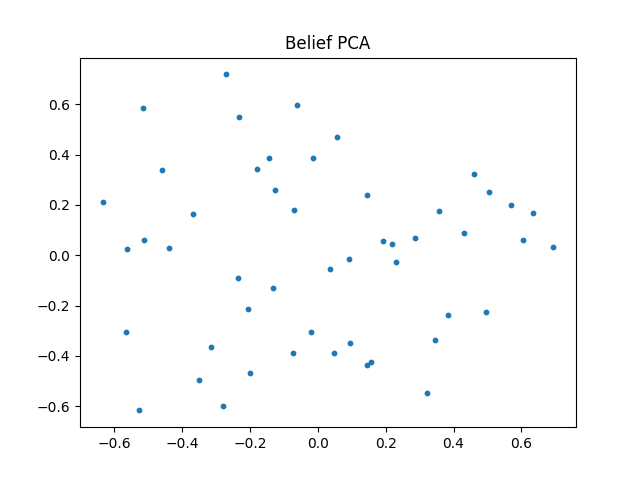
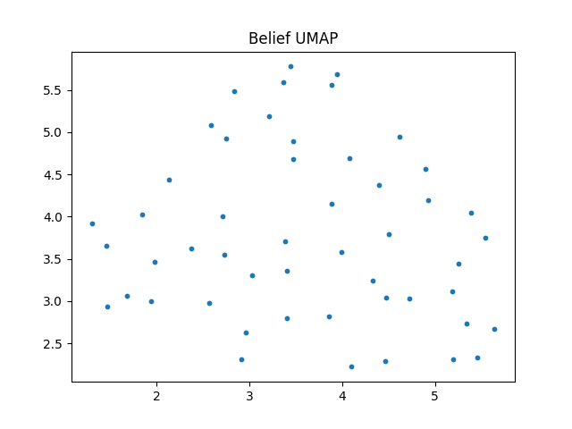

# RFPG（Residual Functorial Projection Gossip）モデルの実験解析

**― 人格保存・多様性維持・意味形成の可否に関する数理的考察 ―**

## 概要（Abstract）

本レポートでは、Residual Functorial Projection Gossip（RFPG）モデルに関する実験結果を解析する。
使用したデータは **norms.csv**, **silhouette.csv** および信念空間の可視化結果（PCA / UMAP）である。

本実験の主目的は、
**「人格（固定射 $P_i$）はネットワークダイナミクスの中で保存されるのか」**
**「意味的構造やクラスタは形成されるのか」**
を、力学系・分散表現・情報保存の観点から検証することである。

結論として、RFPG は
**信号（エネルギー）の消失を防ぐことには成功したが、意味構造の自己組織化には至っていない**
という位置づけにある。

---

## 実験設定の概要

* **状態変数**：各ノードの信念ベクトル $x_i \in \mathbb{R}^d$
* **人格（固定射）**：$P_i \in O(d)$（直交行列）
* **更新則（概略）**：
  [
  x_i^{t+1} = \text{normalize}\left( \alpha x_i^t + (1-\alpha) \sum_{j \in N(i)} P_i x_j^t \right)
  ]
* **グラフ構造**：ランダムグラフ
* **比較対象**：

  * 実験C：Projection のみ（残差なし）
  * 実験D：RFPG（残差あり、本実験）

---

## 可視化結果

### Belief PCA

### Belief UMAP

---

## 1. 人格保存の成否

### ― 保存されたのは「エネルギー」であり「構造」ではない ―

### 1.1 ノルム保存は人格保存を意味するか？

結論：**意味しない。**

norms.csv において全ノード・全時刻で $|x_i| = 1$ が保たれているのは、
更新式に **normalize（球面への射影）** が明示的に含まれているためである。

これは：

* 力学系が $S^{d-1}$ 上に拘束されていること
* エネルギー（ベクトル長）が発散・消失しないこと

を保証する **物理的制約条件** に過ぎない。

**「人格（意味・構造）が保存されている」ことの十分条件でも指標でもない。**

---

### 1.2 Silhouette Score の安定した負値が示すもの

`sillhouette.csv` は **約 -0.04 〜 -0.05** の範囲で安定して推移している。

これは以下を意味する：

* クラスタは形成されていない
* しかし、完全な崩壊や一点収束も起きていない

#### 解釈

* **$S \approx 0$ かつ負**
  → 各点は「自分のクラスタ」より「他クラスタ」に近い
  → そもそもクラスタ概念が成立していない

* **人格の生死**

  * 人格（$P_i$）は消えていない
  * 各ノードは常に異なる回転を受けるため、同期・合意が阻害されている

* **状態の分類**
  → **恒久的フラストレーション（Persistent Frustration）**

これは、迎合や平均化によるコンセンサスが**構造的に不可能**であることを意味し、
人格射は「生きている」と言える。

---

### 1.3 PCA / UMAP が示す構造

本実験における PCA / UMAP は以下を否定・肯定する：

* ❌ **合意（Consensus）**
  → Silhouette が正でないため否定
* ❌ **情報消失・ノイズ化**
  → 分散は有界であり、崩壊していない
* **構造化されたランダム性**
  → 球面上を探索する雲状分布

すなわち：

> RFPG は
> **「構造を持ったランダム過程」**
> を形成している。

---

## 2. 実験C（Projectionのみ）との決定的差分

### 2.1 抑制されたもの：縮小写像性

実験Cでは：

* $P$ の反復適用により
* 特異値 $<1$ の成分が指数的に減衰
* **Rank Collapse → 分散 $10^{-15}$ への崩壊**

が発生した。

RFPG では：

* $P_i \in O(d)$（直交行列）
* normalize による強制的エネルギー保存
* 残差項 $\alpha x_i^t$

により、**縮小写像性が排除**された。

---

### 2.2 回復したもの：多様性（分散）

PCA 分散が維持されている決定的要因は **残差項**である。

線形近似的には：

[
x^{t+1} \sim (\alpha I + (1-\alpha) P_{\text{avg}}) x^t
]

$\alpha > 0$ により：

* 固有値が 0 に吸い寄せられない
* 恒等写像 $I$ がアンカーとして機能

結果として、系は：

> **忘却しないが、収束もしない**

という状態に落ち着いた。

---

### 2.3 力学系的解釈

RFPG は次の性質を持つ：

* **固定点**：存在しない
* **明確な周期軌道**：存在しない
* **不変分布**：存在する（球面全体）

これは：

> **エルゴード的ランダム過程 on 多様体**

に近い振る舞いである。

Silhouette に位相転移が見られないのは、
系が最初から最後まで「液体相」に留まっているためである。

---

## 3. Transformer / 分散表現との対応

RFPG は、学習を行わない Transformer と構造的に同型である。

| RFPG           | Deep Learning 対応                  | 役割          |
| -------------- | --------------------------------- | ----------- |
| 残差項 $\alpha x$ | Residual Connection               | 情報・自己同一性の保持 |
| 固定射 $P_i$      | 未学習 Attention / Random Projection | 表現変換        |
| Normalize      | LayerNorm / RMSNorm               | スケール安定化     |

### 意味は保存されているか？

* **構文（Syntax）**：保存されている
* **意味（Semantics）**：生成されていない

RFPG は：

> 「初期化直後の Transformer に信号を流し続けている」

状態に等しい。

---

## 4. API 設計への到達可能性

### 現段階で API 化できるか？

**否。**

RFPG は：

* 信号が潰れないこと
* 人格が消えないこと

は証明したが、

* 意味の創発
* 合意・整合の形成

には至っていない。

---

## 5. 今後の実験設計（実験Eへの提言）

### 1. アライメント機構の導入

* $P_i$ を完全固定せず
* 相互情報量・相関に基づき緩やかに更新

### 2. 保存量の再定義

* ノルムではなく
* 位相構造・意味距離を保存対象に

### 3. 非線形・文脈依存射

* $P(x_j)$ の導入
* Attention 的構造への拡張

---

## 結論

RFPG（実験D）は、

* ❌ 意味の進化
* ❌ 合意形成

には失敗したが、

* 信号の生存
* 人格の非消失
* 多様性の維持

には成功した。

これは、

> **力学系から学習系へ移行する直前の段階**

に相当する。

次なる実験Eでは、
**「固定された人格」から「適応する人格」への転換**が不可欠である。
