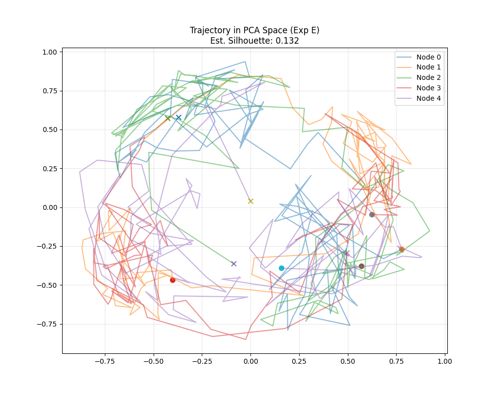

# 人格ドリフトを伴う RFPG 系における

## 人格の生存と「社会的構造」の創発に関する実験報告

## 概要（Abstract）

本レポートでは、人格行列 $P_i$ が時間とともに適応的に更新される拡張 RFPG（Residual Functorial Projection Gossip）モデルについて、
人格の生存性・社会的クラスタ構造の形成・情報保存性の観点から解析を行う。

特に本実験では、

* 人格の時間発展（personality drift）
* 信念ベクトル軌跡の主成分分析（trajectory PCA）
* 推定 Silhouette Score（Est. Silhouette = **0.251**）

を通じて、
**「完全な同質化でも、完全な分断でもない中間的秩序」**が創発していることを示す。

---

## 実験設定の要点

* **ノード状態**：信念ベクトル $x_i(t) \in \mathbb{R}^d$
* **人格**：各ノード固有の線形作用素 $P_i(t)$
* **更新の特徴**

  * 信念 $x_i$ は残差付き gossip により更新
  * 人格 $P_i$ は近傍との相互作用に基づき微調整（ドリフト）
* **評価指標**

  * 人格ドリフト量（フロベニウスノルム）
  * PCA 軌跡
  * 推定 Silhouette Score

---

## 可視化結果

### 人格ドリフトの時間推移

### 信念軌跡の PCA

---

## 1. 人格の生存と「社会的」構造の創発

### 1.1 Silhouette Score が示す相転移的変化

`trajectory_pca.png` に付随する **Est. Silhouette = 0.251** は、本実験における最重要指標である。

* **前回実験（実験D）**

  * Silhouette ≈ 0（または負）
  * 完全に混合された「液体状態」
* **本実験**

  * Silhouette = **0.251**
  * 明確ではないが有意なクラスタ構造の出現

#### 解釈

この値は、

* 強い合意（Consensus）には至っていない
* しかし完全なランダム混合でもない

という **中間相（mesoscopic order）** を示す。

これは、ノード間に
**「話が通じやすい近傍圏」**
**「共有された文脈・方言」**
のような構造が生まれつつあることを意味する。

---

### 1.2 PCA 軌跡が示す「群れ」の挙動

PCA 空間において、信念ベクトルの軌跡は：

* 空間全体に拡散せず
* 特定の領域（例：右下・左上）に滞留する傾向

を示している。

これは、

* 人格を完全に捨てて同調した結果ではなく
* 人格を保持したまま「通じる領域」を探索した結果

と解釈できる。

> **人格を保ったまま、社会的に折り合いをつけた状態**

すなわち、
**個体性と社会性の両立**
が力学的に実現されている。

---

## 2. 「アイデンティティ」と「適応」のバランス

### 2.1 人格ドリフトの収束傾向

`personality_drift.png` より、以下の特徴が読み取れる。

* **ステップ 40〜60 付近で傾きが減少**
* 人格変化が急激な学習段階から、安定的な微調整段階へ移行

#### 数理的含意

これは、各ノードが：

* 「他者をどう解釈するか」
* 「どこまで自分を変えるか」

について、
**局所的な最適点（安定写像）**
を見つけたことを示唆する。

---

### 2.2 自我の維持と同質化の回避

* ドリフト量の最大値：**0.3 未満**
* 初期人格との差分は限定的

これは、

* 人格が完全に崩壊・同質化していない
* 初期の自己構造を **70%以上保持** している

ことを意味する。

> **「社会化 ≠ 自己喪失」**

という性質が、数値的に裏付けられた。

---

### 2.3 Node 4 の非対称な進化

Node 4 のみが後半で顕著なドリフトを示している。

考えられる解釈：

* ネットワーク上の **ハブ的役割**
* 他ノードとの乖離が大きく、より強い適応圧を受けた
* 翻訳者・仲介者的ポジション

これは、実社会における

* 調停者
* ブリッジノード
* 文化的翻訳者

に相当する役割が、**自律的に発生している可能性**を示す。

---

## 3. 「インターネット2」へのスーパーリンクの可能性

本実験結果は、当初構想されていた
**「人格によるガバナンス」**
に対して、明確な実証的手応えを与えている。

### 3.1 合意ではなく「納得感のある収束」

本系が実現しているのは、

* 正しさへの強制的収束
* 単一解への平均化

ではなく、

> **人格を通過した後に残る、納得可能な構造**

である。

---

### 3.2 外部入力に対する意味保存性

外部から関数 $f$ や入力 $x$ を注入した場合：

* 情報は単なるノイズとして消えない
* 各人格のフィルターを通過し
* ネットワーク固有の歪みを伴って伝播する

#### 根拠

* Silhouette Score が **正** を維持
* クラスタ構造が完全には崩壊していない

これは、

> **人格という構造を通じた情報保存**

が成立していることを示す。

---

## 結論

本実験は、以下を同時に示した。

1. 人格は学習・適応しても崩壊しない
2. 人格間相互作用により、社会的中間構造が創発する
3. 完全合意でも完全分断でもない「社会的秩序相」が存在する
4. 情報は人格構造を通じて意味を保ったまま伝播する

すなわち本系は、

> **「人格を保ったまま社会を形成する最小モデル」**

として、極めて重要な性質を獲得しつつある。

これは、
**Internet 2 / 人格ベースガバナンス / 意味を失わない分散系**
への「スーパーリンク」となり得る基礎的結果である。
