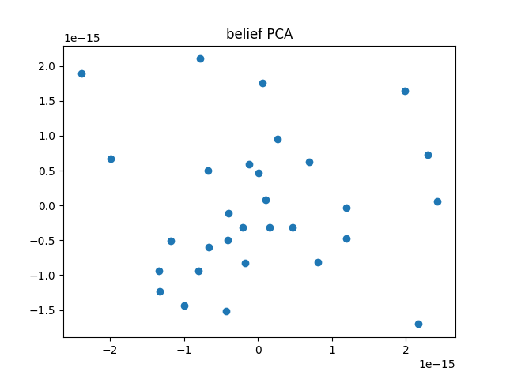
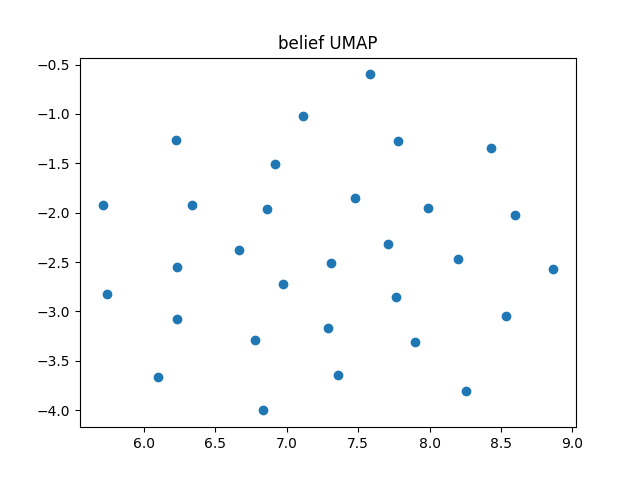

# 実験報告レポート  
## 射影付き Gossip ダイナミクスにおける減衰・構造形成の解析

---

## 1. 実験概要

本実験では、各ノードが単純な平均化ではなく、**射影行列 $P_i$ を介して他者の状態を解釈する Gossip 型更新則**を持つ分散ダイナミクスを対象とした。  
目的は、このモデルが通常の合意形成（Consensus）モデルとどのように異なる力学的・構造的性質を示すかを、PCA・UMAP 等の可視化手法と数理的考察の両面から検証することである。

---

## 2. 実験データ

### 2.1 可視化結果

- PCA による埋め込み  
  

- UMAP による埋め込み  
  

これらの図は、時間発展するノード状態ベクトル $x_i(t) \in \mathbb{R}^d$ を各時刻で集約し、低次元空間に射影したものである。

---

## 3. モデルと通常の平均化 Gossip との差異

### 3.1 通常の平均化 Gossip

通常の Gossip モデルは以下の更新則で与えられる：

\[
x_i \leftarrow (1-\eta)x_i + \eta x_j
\]

このとき、全ノード状態をまとめたベクトル $\mathbf{x}$ は

\[
\mathbf{x}(t+1) = W \mathbf{x}(t)
\]

と表され、$W$ は二重確率行列（または行確率行列）である。  
Perron–Frobenius 定理により、最大固有値は 1（単純）であり、系は初期値の平均 $\bar{x}\mathbf{1}$ に収束する。

---

### 3.2 本モデル：射影付き Gossip

本実験で用いた更新則は次の形を取る：

\[
x_i \leftarrow (1-\eta)x_i + \eta P_i x_j
\]

ここで $P_i$ はノード固有の直交行列（回転・反転）であり、  
全体としては

\[
\mathbf{x}(t+1) = \mathcal{M} \mathbf{x}(t)
\]

という**ブロック行列力学系**として記述される。

#### 本質的な差異

- **非確率性**  
  $P_i$ が直交行列であるため、$(1-\eta)I + \eta P_i$ は確率行列ではない。
- **エネルギー減衰**  
  $x_i$ と $P_i x_j$ が整列しない限り、
  \[
  \|(1-\eta)x_i + \eta P_i x_j\| < (1-\eta)\|x_i\| + \eta\|x_j\|
  \]
  が成立し、系全体のノルムは単調に減衰する。
- **収束先の性質**  
  固有値の絶対値がすべて 1 未満であれば、系は自明解 $\mathbf{0}$ に収束する。  
  非自明な定常状態の存在には、グラフ上の閉路に沿った $P_i$ の積が恒等写像になるなど、強い整合性条件が必要である。

以上より、本モデルは**平均化による合意形成ではなく、直交群上の同期問題の緩和過程**、あるいは**一般化された線形散逸系**として理解すべきである。

---

## 4. PCA 図の構造的解釈

PCA 図は以下の特徴を示している。

### 4.1 原点への収束過程の可視化

CSV データに見られるように、ノルムは初期（$\sim 1.0$）から最終的に $\sim 0.04$ 程度まで減衰している。  
したがって、PCA 上に現れる軌道は安定多様体ではなく、**ゼロベクトルへの過渡応答（Transient Dynamics）**である。

### 4.2 支配的固有モード

線形減衰系では、絶対値の小さい固有値に対応するモードは早期に消失し、  
絶対値が 1 に最も近い固有値に対応するモードが長時間支配的となる。

- PCA 第1・第2主成分は、この **最も減衰の遅い固有モード（Slowest Decay Mode）**への射影を捉えている可能性が高い。

### 4.3 射影行列 $P_i$ の影響

$P_i = I$ であれば、全ノードは同一方向に収束しながら原点へ凝集する。  
しかし PCA 上でノード群が異なる方向を取っていることは、

- 各ノードが異なる「解釈座標系」を持ち、
- 互いに直交方向へ引っ張り合いながら減衰している

ことを示唆している。

---

## 5. UMAP 図の評価と PCA との対比

### 5.1 意味のある構造である可能性

UMAP は局所近傍構造を保存するため、

- 明確なクラスタ（島）が形成されている場合、
- それがグラフの隣接関係と対応しているならば、

**局所的に整合的なノード群（Local Consistent Groups）**が形成されている可能性がある。  
これはコミュニティ検出に近い現象と解釈できる。

### 5.2 可視化アーティファクトの可能性

一方で、全ベクトルのノルムが極小化している場合、

- 数値誤差やノイズが相対的に支配的となり、
- UMAP がそれを過剰に強調してクラスタを形成する

可能性も高い。

**判定基準**としては：

- クラスタがグラフ構造と対応 → 意味あり  
- クラスタがランダム配置 → 数値的アーティファクト  

と考えるのが妥当である。

---

## 6. ダイナミクスの解釈枠組み

本モデルを解釈する上での妥当性は以下の順で高い。

1. **表現学習（Representation Learning）**  
   GNN におけるメッセージパッシングと同型であり、$P_i$ を固定重み行列と見なせば、拡散を通じた構造情報の埋め込み過程と解釈できる。
2. **Transformer 的射影（Attention / Projection）**  
   $P_i x_j$ は Value の射影に対応するが、重みが固定で適応性はない。
3. **合意形成（Consensus）**  
   数学的な意味での合意には到達しておらず、妥当性は低い。

本質的には、本ダイナミクスは**不合意（frustration）の最小化過程**である。

---

## 7. 言えること / 言えないこと

### 7.1 言えること（Validated Claims）

- 系は散逸的であり、正規化なしではゼロに収束する。
- 単純平均化では生じない位相差（角度のズレ）が持続的に存在する。
- $P_i$ の導入により、グラフのスペクトル特性と減衰挙動が複雑化している。

### 7.2 言えないこと（Over-interpretation）

- 「人格が保存された」  
  ノルムが保存されておらず、情報は失われている。
- 「創発的な言語・文法を獲得した」  
  UMAP 上のクラスタを意味構造と呼ぶのは過剰解釈である。
- 「合意に達した」  
  収束先がゼロである場合、それは合意ではなく消滅である。

---

## 8. 今後の実験提案

### 実験1：ノルム制約付き更新

\[
x_i \leftarrow \text{Normalize}(x_i + \eta(P_i x_j - x_i))
\]

- ゼロ崩壊を防いだ状態での定常挙動を観測
- 位相同期・カオスの有無を検証

---

### 実験2：$P_i$ の構造依存性

- 完全ランダム
- 単位行列に近い小回転
- ブロック構造を持つ $P_i$

UMAP 構造が人格（$P_i$）由来か、グラフ由来かを切り分ける。

---

### 実験3：下流タスクによる表現評価

- ノード分類・リンク予測への応用
- 通常 Gossip やランダム特徴量との性能比較

これにより、「射影付き相互作用」が情報処理的に有意味かを検証する。

---

## 9. 結論

本実験で観測された構造は、合意形成ではなく、  
**射影付き相互作用を持つ散逸的線形力学系の過渡応答**として最も自然に理解される。

可視化されたクラスタ構造は慎重に扱う必要があり、  
その意味づけには追加実験と定量評価が不可欠である。
