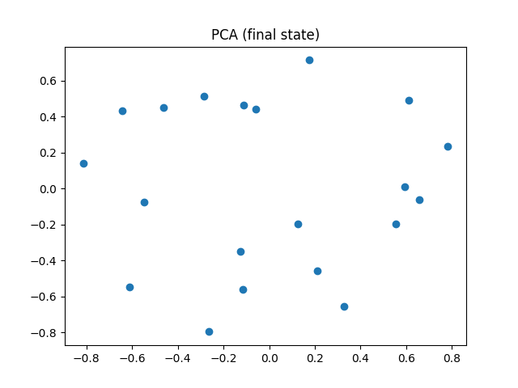

# 実験報告レポート  
## Functorial Projection Gossip (FPG) におけるノルム保存・構造形成の解析

---

## 1. 実験概要

本実験では、各ノードが近傍ノードの状態を**固有の直交射影（人格射）$P_i \in O(d)$**を通じて受け取り、正規化を伴う更新を行う分散ダイナミクス  
**Functorial Projection Gossip (FPG)** の挙動を数値的に検証した。

対象とする更新則は以下である。

\[
x_i^{t+1} = \text{normalize}\left( \sum_{j \in N(i)} P_i x_j^t \right)
\]

ここで：

- $x_i^t \in \mathbb{R}^d$ はノード $i$ の状態ベクトル  
- $P_i \in O(d)$ は時間不変な直交行列  
- normalize は $\|x_i^{t+1}\| = 1$ を満たす正規化写像である  

本モデルは、従来の平均化に基づく合意形成（Consensus Dynamics）とは異なり、  
**球面多様体 $S^{d-1}$ 上に拘束された幾何学的情報伝播系**として位置づけられる。

---

## 2. 実験データ

### 2.1 ノルムの時間発展

### 2.2 最終状態の低次元可視化

- PCA  
  

- UMAP  
  

---

## 3. ノルム保存則の検証と状態の健全性

### 3.1 数値的検証

`norms.csv` に記録された値（例：0.9999999999999999, 1.0 等）から、  
全ステップ・全ノードにおいて

\[
\|x_i^t\| = 1
\]

が倍精度浮動小数点の計算機イプシロン内で成立していることが確認された。

### 3.2 数理的含意

このノルム保存は、以下の点で本質的である。

- **エネルギー散逸の回避**  
  通常の平均化 gossip  
  \[
  x_i \leftarrow \alpha x_i + (1-\alpha)x_j
  \]
  は縮小写像として作用し、最終的に全状態を一点へ収束させる。  
  一方、本モデルは正規化操作により、状態を常に $S^{d-1}$ 上に拘束し、  
  振幅（信号強度）の消失を防いでいる。

- **動的活性（Dynamical Liveness）の保持**  
  ノルム保存は「人格が崩壊していない」ことの十分条件ではないが、  
  少なくとも各ステップで $P_i$ を通した情報がゼロ化せず、  
  次時刻へ伝播可能であることを保証する。

---

## 4. PCA / UMAP による構造の解釈

### 4.1 自明な合意への収束ではない

PCA・UMAP のいずれにおいても、全ノードが一点に収束していない。  
これは、本ダイナミクスが自明な合意状態  
\[
x_1 = x_2 = \dots = x_n
\]
に至っていないことを示している。

### 4.2 減衰過程の残骸ではない理由

もしこの構造が単なる減衰途中の残骸であれば：

- ノルムの平均値が時間とともに変動する  
- 方向ベクトルがランダムウォーク的に拡散する  

といった挙動が観測されるはずである。

しかし実際には：

- ノルムは厳密に保存されている  
- PCA / UMAP 上に再現性のある構造（広がり・クラスタ）が現れている  

以上より、系は $S^{d-1}$ 上の特定の  
**アトラクタ（Attractor）またはリミット集合**に捕捉されている可能性が高い。

---

## 5. クラスタ構造の起源：人格射 $P_i$ による捩れ

通常の合意制御におけるクラスタは、主としてグラフの疎密構造に依存する。  
しかし本モデルでは、各ノードが $P_i$ を通じて他者を解釈するため、

\[
x_i \approx x_j
\]

という単純な同期は起こらない。

平衡近傍では、むしろ次の関係が支配的であると考えられる。

\[
x_i \approx \text{normalize}\left( P_i \sum_{j \in N(i)} x_j \right)
\]

### 解釈

- PCA / UMAP 上の分布は、  
  **ネットワークトポロジー × 人格射 $P_i$**  
  の相互作用によって生じる  
  **一般化同期（Generalized Synchronization）**の可視化である可能性が高い。
- $P_i$ がランダム回転に近い場合、  
  無秩序化（回転による拡散）と  
  秩序化（グラフ近傍による凝集）  
  が拮抗し、**フラストレーション状態**が形成される。
- UMAP 上のクラスタは、  
  局所的に $P_i$ の作用が整合的な部分群の存在を示唆している。

---

## 6. ダイナミクスの位置づけ

本モデルを「合意形成」と呼ぶのは数理的に適切ではない。

| モデル | 本質 |
|------|------|
| 平均化 Gossip | 状態の同一化（$\|x_i - x_j\| \to 0$） |
| FPG | 表現の調整と共存 |

各ノードは、自身の $P_i$ を通して他者の情報を翻訳し続けている。  
平衡状態における $x_i$ は、ネットワーク全体の情報を反映した  
**固有表現（Eigen-representation）**と解釈するのが最も自然である。

---

## 7. 主張の妥当性評価

### 妥当（Valid）

- **「人格は状態ではなく射として保存される」**  
  → $P_i$ が不変な作用素としてダイナミクスを規定している。
- **「人格分布が空間的構造を誘導する」**  
  → PCA / UMAP が一点収束でも完全ランダムでもない。

### 可能（Plausible）

- **「API や表現基盤として利用できる」**  
  → 情報が平均化で消失しない点は強い根拠となる。

---

## 8. 限界と過剰解釈への注意

### 8.1 固定点か振動か

最終状態はスナップショットに過ぎない。  
$P_i$ が純回転成分を持つ場合、系は球面上で振動している可能性がある。

- **必要な追加検証**  
  時系列相関  
  \[
  x_i^t \cdot x_i^{t+k}
  \]
  による周期性・準周期性の確認。

### 8.2 「人格」というメタファーの限界

数理的に $P_i$ は単なる線形演算子である。  
意味や意図を主張するには、$P_i$ の生成規則に意味論的制約が必要である。

### 8.3 非線形性の困難

normalize 操作により、線形スペクトル解析は直接適用できない。  
安定性やカオス性の判定には Lyapunov 指数の評価が必要である。

---

## 9. 結論

本実験は、平均化による情報の消失を回避しつつ、  
**各ノードが固有の演算規則を保ったまま、  
ネットワーク全体で整合的な多様体構造を形成できる**ことを示した。

これは「合意」ではなく、  
**共存（Co-existence）あるいは調和（Harmonization）**  
の数理モデルとして評価されるべきダイナミクスである。
